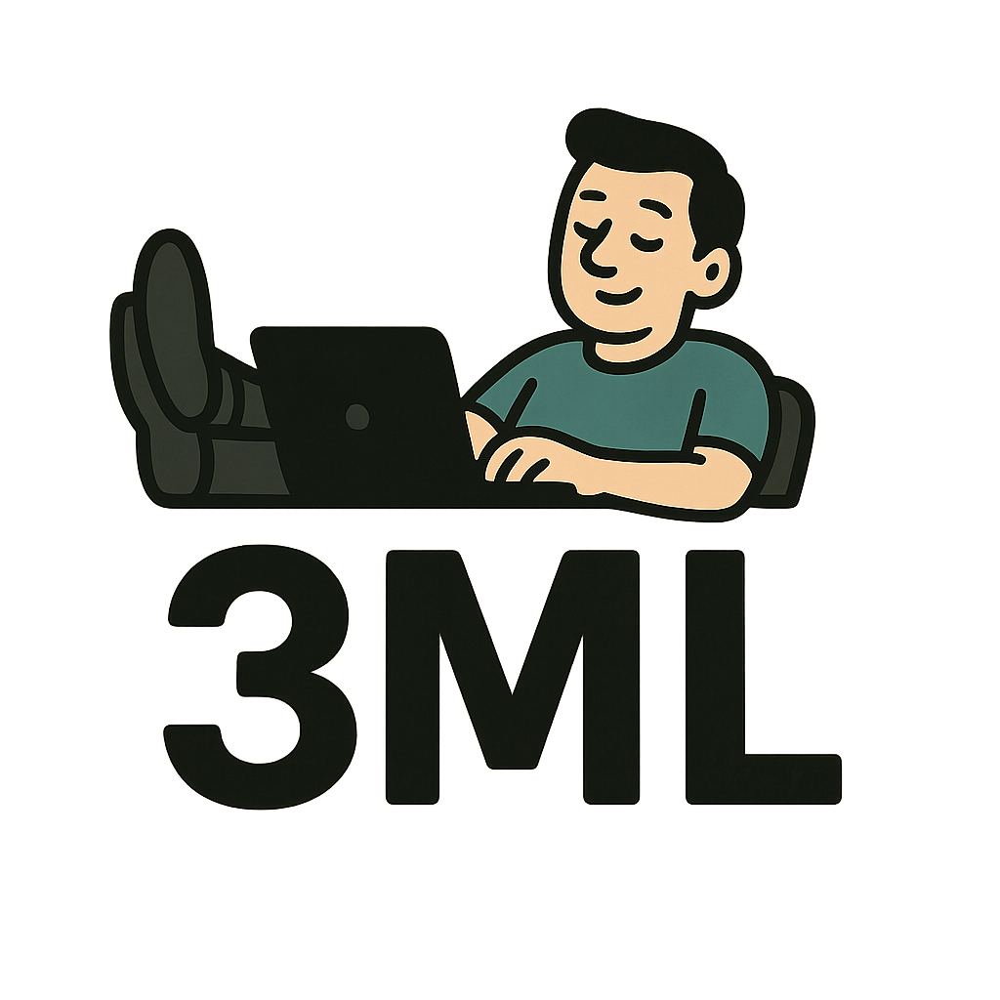

  
  <h3 align="center">Make Me More Lazy</h3>

<em>Are you copying the <b>same template files for the basic project that uses docker</b> over and over again? </em>
  
<em>Make Me More Lazy or 3ML is here to help you create your basic templates that are used by most <b>DevOps</b> engineers.

